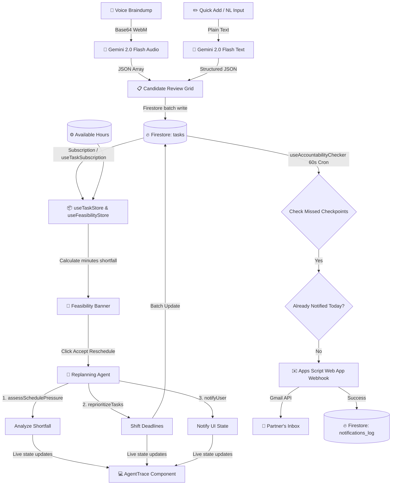

# ⚡ DeadlineAI — Autonomous Productivity Companion

> **The Last-Minute Life Saver** · Built for the BlockseBlock Hackathon (Problem Statement 1)

DeadlineAI is a zero-latency, serverless productivity companion designed to save chronic procrastinators from catastrophic deadline failures. Operating entirely on the browser frontend (leveraging direct Google AI SDK calls and Firebase Spark plan), it turns chaotic, unorganized workloads into realistic, feasibility-checked schedules and deploys automated AI agents to keep you accountable.

---

## 🧭 Architecture Design & Data Flow



---

## 🛠️ Core Tech Stack

*   **Frontend**: React 18, Vite 5, TypeScript, TailwindCSS 3
*   **State Management**: Zustand (real-time store hydration)
*   **AI Engine**: Gemini 2.0 Flash (called directly via `@google/generative-ai` frontend SDK)
*   **Database & Auth**: Firebase Firestore & Firebase Auth (Google Sign-In)
*   **Hosting**: Firebase Hosting (Spark Tier compliance)
*   **Notification Engine**: Standalone Google Apps Script Web App (Gmail SMTP client)
*   **No Blaze plan or Cloud Functions required** (completely free-tier compliant)

---

## ✨ Key Features & Technical Specifications

### 🎤 1. Voice Braindump
Capture raw, unstructured, bilingual thoughts (Hindi, English, or Hinglish) and let Gemini parse them into distinct task definitions.
*   **Audio Capture**: Client-side recording using HTML5 `MediaRecorder` API encoded into lightweight `audio/webm` at standard bitrates.
*   **Direct Gemini Processing**: Reads the recorded blob as base64 and feeds it to the `gemini-2.0-flash` model.
*   **Review Layer**: Displays tasks in a checklist format allowing edits to *Title*, *Type* (Assignment, Exam Prep, Meeting Prep, Email, Bill Payment, General), *Priority* (P1–P5), and *Estimated Duration* before writing to Firestore.

### 🚨 2. Deadline Reality Engine
A real-time feasibility checking system that compares your total estimated work minutes against your configured available hours for the day.
*   **Feasibility Calculation**: Aggregates all pending and in-progress tasks scheduled for the day.
*   **Amber/Red Warning Banner**: Displays an alert when your task commitments exceed available hours, calculating the exact minute shortfall.
*   **One-Tap Reschedule**: Integrates with the Replanning Agent to fix your schedule instantly.

### 🤖 3. Autonomous Day Replanning
A multi-turn Gemini agent that automatically resolves schedule overloads using Function Calling.
*   **The 3-Tool Loop**: Operates on three native JSON function declarations:
    1.  `assessSchedulePressure`: Calculates time overloads and highlights high-risk tasks.
    2.  `reprioritizeTasks`: Postpones lower-priority items past midnight or to tomorrow.
    3.  `notifyUser`: Dispatches local UI notifications detailing the agent's plan.
*   **Live AgentTrace**: A custom developer and user console that visualizes the agent's reasoning process and function execution live in real time.

### ✉️ 4. Social Accountability Agent
An automated checker that flags when you miss key progress targets and alerts your accountability partners.
*   **Progress Targets**: Tasks can include target checkpoints (e.g., "50% complete by 5 PM") and a partner's email.
*   **60-Second Loop**: A background effect checks task deadlines and checkpoints every 60 seconds.
*   **Idempotent Dispatch**: Resolves warnings via an external Google Apps Script webhook. Checks `notifications_log` to guarantee that no duplicate accountability emails are sent in a single 24-hour window.

### 📅 5. Client-Side iCalendar (.ics) Export
Download tasks directly as calendar events compatible with Google Calendar, Apple Calendar, and Outlook.
*   Generates RFC 5545 compliant `.ics` formatting completely client-side.
*   Correctly maps priorities, estimated durations, and detail descriptions with standard formatting.

### 🧠 6. Procrastination Pattern Analysis
Get a personalized, doctor-style analysis of your productivity habits.
*   Processes the past 30 days of task metrics (including completed, missed, and rescheduled status histories).
*   Gemini constructs a behavior pattern diagnostics report highlighting common pitfalls and actionable lifestyle tips.

---

## ⚡ Pipelines & Data Flow Specifications

### A. Voice Intake Pipeline
1. `MediaRecorder` starts -> audio chunks accumulated in local refs.
2. On stop, blobs are combined and parsed into `Base64` via `FileReader`.
3. Base64 payload is wrapped in Gemini inline parts structure: `data` + `mimeType: "audio/webm"`.
4. Gemini outputs a schema-validated JSON array of candidates.
5. React maps candidates to the checklist review UI.

### B. Accountability Notification Pipeline
1. Hook checks tasks: `status != "done"` AND `checkpointTime < now` AND `checkpointMet == null`.
2. Queries Firestore `notifications_log` to ensure no alert was sent today for the task.
3. If clear, dispatches an HTTPS POST request to Google Apps Script.
4. Script sends Gmail to partner; returns `success`.
5. App creates a record in `notifications_log` and updates the task `checkpointMet` state.

---

## 📈 Performance & Resource Footprint

*   **Dynamic Bundle Splitting**: The Gemini Replanning Agent code and JSON schemas are separated into dynamic chunks to keep the initial load bundle size small.
*   **Real-time Subscriptions**: Firestore data uses `onSnapshot` queries, which only sync delta modifications, minimizing database read charges.
*   **Client-Side Generation**: Tasks exports (`.ics`) and PDF sheets are generated in the browser to reduce server overhead.

---

## 🔐 Security & Firestore Access Rules

Default-deny rules are enforced across the entire database:
*   **`tasks`**: Can only be created, read, updated, or deleted by authenticated users whose UID matches the document's `userId` field.
*   **`users`**: Users can only read or write their own user profile document.
*   **`notifications_log`**: Read/write access restricted to the user associated with the logs.

---

## 🖼️ Application Screenshots

*Below are placeholders for the visual demonstration of DeadlineAI:*

### 1. Dashboard Page & Login Page
<br />


### 2. Today's Reality View & Feasibility Banner
<br />


### 3. Voice Braindump Review Overlay
<br />


---

## 🚀 Setup & Local Development

1.  **Install dependencies**:
    ```bash
    npm install
    ```
2.  **Add Environment Variables**:
    Create a `.env` file in the root directory based on `.env.example` and fill in your credentials from the Firebase Console and Google AI Studio.
3.  **Run Development Server**:
    ```bash
    npm run dev
    ```
4.  **Run Tests**:
    ```bash
    npm run test
    ```
